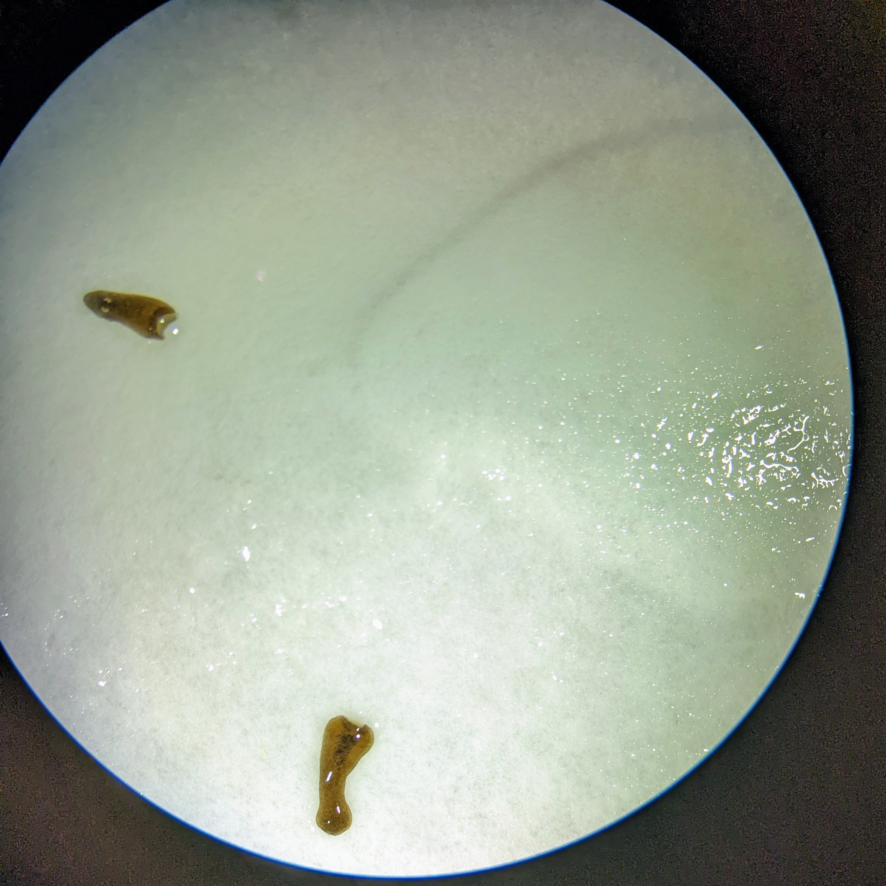
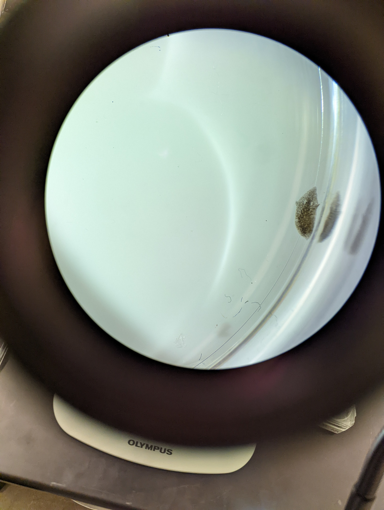

\newpage

```{r setup, include=FALSE}
knitr::opts_chunk$set(echo = F, warning = FALSE, message = FALSE)
library(tidyverse)
library(kableExtra)
library(hablar)
set.seed(1234)


watch_schedule <- read_csv("https://docs.google.com/spreadsheets/d/1Xwmnsy9RjIsFgfj2WjAcA4h1AzYWQaRr06DwQG8A9mI/gviz/tq?tqx=out:csv&sheet=watch-schedule")


#group_data <- read_csv("https://docs.google.com/spreadsheets/d/1Xwmnsy9RjIsFgfj2WjAcA4h1AzYWQaRr06DwQG8A9mI/gviz/tq?tqx=out:csv&sheet=data-collection")


class_data <- read_csv("Lab 2/R_ClassPlanariaData_S22.csv") %>%
  mutate(segment = tolower(segment),
         Treatment = tolower(Treatment))

class_data["New Pharynx appearance on HEAD (Y/N)"][is.na(class_data["New Pharynx appearance on HEAD (Y/N)"])] <- "N"
class_data["New Eye spot appearance on TAIL (Y/N)"][is.na(class_data["New Eye spot appearance on TAIL (Y/N)"])] <- "N"


class_data <- class_data %>%
  unite(regrowth, c(`New Eye spot appearance on TAIL (Y/N)`, `New Pharynx appearance on HEAD (Y/N)`)) %>%
  mutate(`New Eye spot appearance on TAIL (Y/N)` = class_data$`New Eye spot appearance on TAIL (Y/N)`,
         `New Pharynx appearance on HEAD (Y/N)` = class_data$`New Pharynx appearance on HEAD (Y/N)`) %>%
  mutate(day_growth = pmax(if_na(class_data$`Day of new pharynx appearance`, 0), if_na(class_data$`Day of new eye spot appearance`, 0)), 
         day_growth = ifelse(day_growth==0, NA, day_growth))

class_data$regrowth[grep("Y", class_data$regrowth)] <- TRUE
class_data$regrowth[grep("N", class_data$regrowth)] <- F


PZQ_data <- class_data %>%
  filter(Treatment == "PZQ")

control_data <- class_data %>%
  filter(Treatment == "control")

heads_data <- class_data %>%
  filter(segment == "head")

tails_data <- class_data %>%
  filter(segment == "tail")

```


# PZQ Impact on Regrowth

The null hypothesis for this section is the proportion of PZQ treated segments will regrow the same proportion as those in the control treatment. 

```{r}
table(tolower(heads_data$Treatment), heads_data$`New Pharynx appearance on HEAD (Y/N)`)

chi_heads <- chisq.test(tolower(heads_data$Treatment), heads_data$`New Pharynx appearance on HEAD (Y/N)`)


```

Head segments exposed to PZQ ($\frac{10}{66}$) are stastically significantly less likely to regrow than the control treatment ($\frac{29}{66}$) ($\chi^2$, $X^2=$ `r chi_heads$statistic`, $df=1$ $p=$ `r chi_heads$p.value`)

```{r}
table(tolower(tails_data$Treatment), tails_data$`New Eye spot appearance on TAIL (Y/N)`)


chi_tail <-chisq.test(tolower(tails_data$Treatment), tails_data$`New Eye spot appearance on TAIL (Y/N)`)
```


Tail segments exposed to PZQ ($\frac{11}{66}$) are statistically significantly less likely to regrow than the control treatment ($\frac{57}{66}$) ($\chi^2$, $X^2=$ `r chi_tail$statistic`, $df=1$,  $p=$ `r chi_tail$p.value`)


```{r}

class_data %>%
  ggplot(aes(x=Treatment, fill = regrowth)) +
  geom_bar() +
  facet_wrap(~segment) +
  labs(title = "Regrowth by treatment and segment") +
  scale_fill_discrete(name = "Specimen regrowth", labels=c("Did not Regrow", "Regrew"))

```


# ANOVA Test

The null hypothesis is that across groups planaria take the same number of days to regenerate. 

```{r}

class_data %>%
  ggplot(aes(x=Treatment, y = day_growth, fill = Treatment)) +
  geom_boxplot() +
  geom_jitter(width = 0.15) +
  facet_wrap(~segment) +
  labs(title = "Days before regrowing missing segment", y = "Day first observed", caption = "Points represent individual Planaria") + 
  theme(legend.position = "none")
  
```

The mean number of days before regrowing based on the segment was not statistically significantly longer for heads (`r mean(class_data$day_growth[class_data$segment=="head"], na.rm=T)`) than the tail group (`r mean(class_data$day_growth[class_data$segment=="tail"], na.rm=T)`). (Two-Way ANOVA, $df=1$, $\sum ^2=0.398005$, $f=0.1553$, $p=0.6943$) 


The mean number of days before regrowing based on the treatment is statistically significantly longer in the PZQ group (`r mean(class_data$day_growth[class_data$Treatment=="pzq"], na.rm=T)`) than the control group (`r mean(class_data$day_growth[class_data$Treatment=="control"], na.rm=T)`). (Two-Way ANOVA, $df=1$, $\sum ^2=10.776460$, $f=4.2050$, $p=0.0428$) 


There is no statistically significant interaction between treatment and segment in the PZQ group (head, PZQ `r mean(class_data$day_growth[class_data$Treatment=="pzq"][class_data$segment=="head"], na.rm=T)`; head, control `r mean(class_data$day_growth[class_data$Treatment=="control"][class_data$segment=="head"], na.rm=T)`; tail, PZQ `r mean(class_data$day_growth[class_data$Treatment=="pzq"][class_data$segment=="tail"], na.rm=T)`; head, control `r mean(class_data$day_growth[class_data$Treatment=="control"][class_data$segment=="tail"], na.rm=T)`). (Two-Way ANOVA, $df=1$, $\sum ^2=3.118567$, $f=1.2169$, $p=0.2725$).


# Figures


{height=40%}


{width=45%} {width=45%}


The figures above are pictures of two regrowing segments taken on day 4. 

On the left is a regenerating tail which is significantly longer than the head segment. Although it does not have fully reformed eyes, there is a rough outline that suggests that it is beginning to reform the core of its head.


On the right is one of the sample head segments. The segment in this figure is currently in the early phases of its regeneration.


{width=80%}

Above is a planaria segment from the PZQ treatment that disintegrated. There are no distinguishable planaria features that can be discerned from the image above. 


# Author Contributions


Connie Mangan performed analysis in `jmp`, Morgan LeMay dissected the planaria for lab, and Taylor Blair created graphics and formatted the document. All authors contributed equally to the write-up.

The checking schedule was divided accordingly:

```{r}

watch_schedule %>%
  select(-`Checked (Y/N)`) %>%
  kable(caption = "Watch Schedule") %>%
  kable_styling(latex_options = "HOLD_position")

```


# Grading

*This section left empty for grader feedback.*

## Table

| **Component** | **Excellent** |	**Good**	| **Satisfactory**	| **Incomplete/Needs Work** | 
|---------------|---------------|-----------|-------------------|---------------------------|
|Report organization |          |           |                   |                           |
|Abstract: Background & Scientific Question |          |           |                   |                           |
|Abstract: Methods & Results |          |           |                   |                           |
|Abstract: Discussion  |          |           |                   |                           |
|Figure/Graphs |          |           |                   |                           |
|Figure Legend  |          |           |                   |                           |
|Statistical Results |          |           |                   |                           |


## Other Comments


