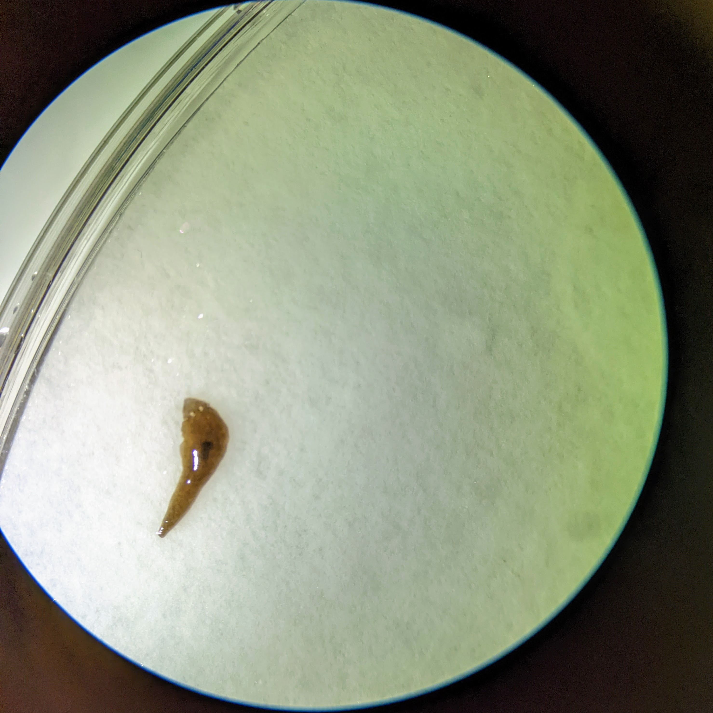
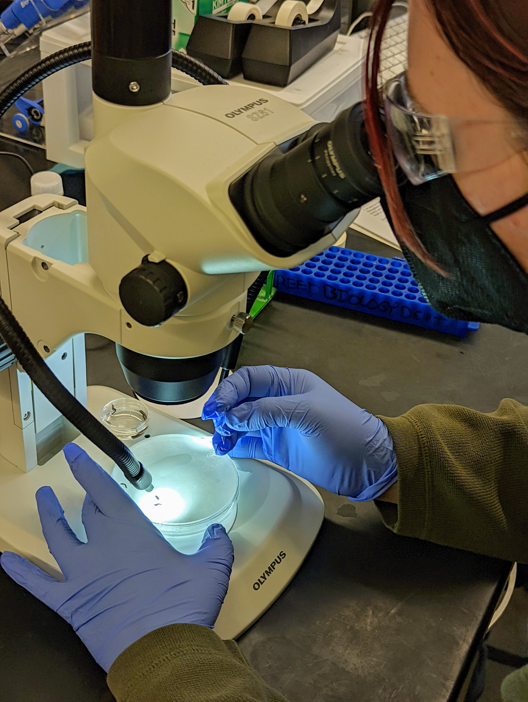
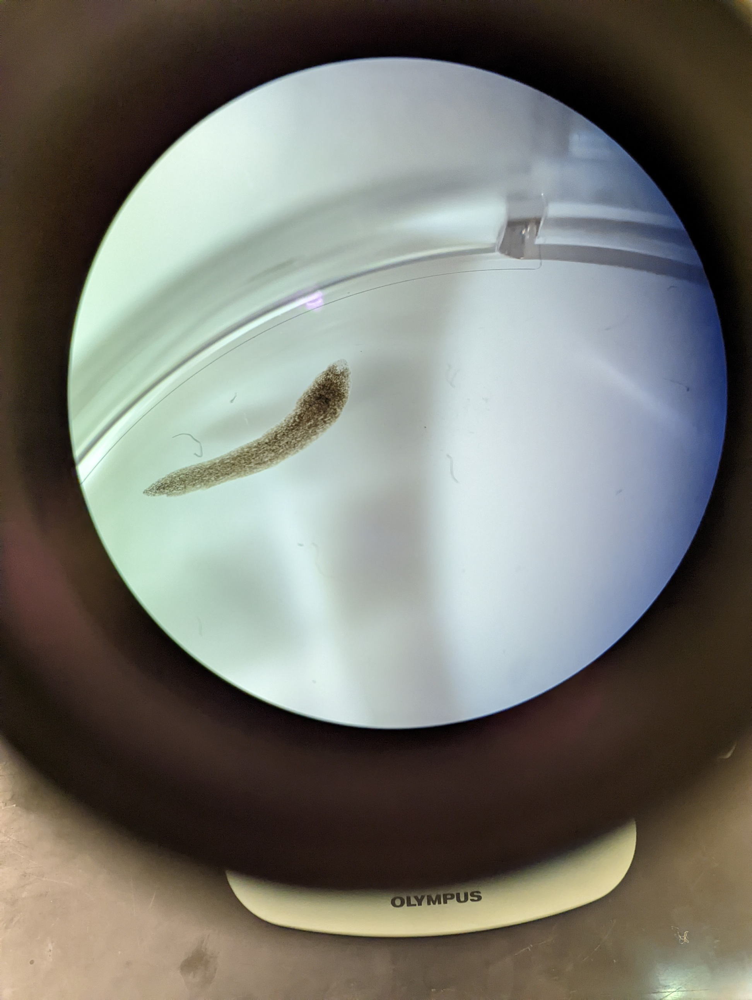
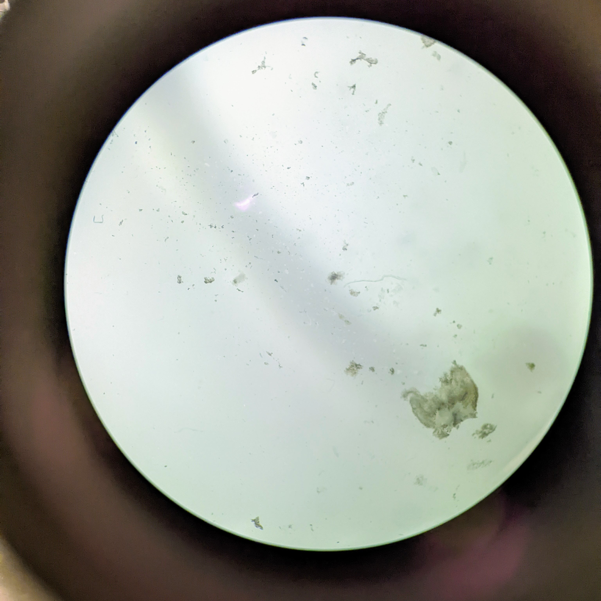

\newpage

```{r setup, include=FALSE}
knitr::opts_chunk$set(echo = F, warning = FALSE, message = FALSE)
library(tidyverse)
library(kableExtra)
set.seed(1234)
```

# Introduction

This Lab investigated the link between PZQ and regeneration in 

## Planria


Planaria have been used in many research settings with studies ranging from drug tolerance studies (@raffa2001cocaine), memory transfer (@hartry1964planaria), and ... They have been most notably studied for their neoblast system which is ....

## PZQ (Praziquantel)

Praziquantel, often shortened to PZQ, is a drug created by GSK and Pfizer... It is most notably used as an antiparasitic drug discovered in (@wikipediaPlanaria).

Although not directly related to this lab, there is a body of research investigating parasites slowly evolving to become drug resistant to PZQ. In a 2016 study by a group of researchers from Portugal studying Schistosomiasis, a parasitic disease that kills 280,000 annually, investigated the difference of resistant parasites versus non resistant parasites. What they obsereved was a morphological difference between the two groups (@pinto2016morphological).

## Lab Setup

The Planaria were provided by the Reed Biology Department. Planaria were  This lab used a dissection microscope to aid in 


## Data

Data was collected in this lab on a daily basis from February 3rd to Feburuary 10th (see @ref(tab:watch-schedule) for the watch schedule). Observations were performed using a dissection microscope (See figure)

```{r}

watch_schedule <- read_csv("https://docs.google.com/spreadsheets/d/1Xwmnsy9RjIsFgfj2WjAcA4h1AzYWQaRr06DwQG8A9mI/gviz/tq?tqx=out:csv&sheet=watch-schedule")


group_data <- read_csv("https://docs.google.com/spreadsheets/d/1Xwmnsy9RjIsFgfj2WjAcA4h1AzYWQaRr06DwQG8A9mI/gviz/tq?tqx=out:csv&sheet=data-collection")


class_data <- read_csv("https://docs.google.com/spreadsheets/d/1bE73dti6HzgLeVEIPzy5Nlw1Jk8apOKO4sbrcLtrTMs/gviz/tq?tqx=out:csv&sheet=B21-(Katie)") %>%
  tail(-2) %>%
  mutate(segment = tolower(segment),
         Treatment = tolower(Treatment))

class_data["New Pharynx appearance on HEAD (Y/N)"][is.na(class_data["New Pharynx appearance on HEAD (Y/N)"])] <- "N"
class_data["New Eye spot appearance on TAIL (Y/N)"][is.na(class_data["New Eye spot appearance on TAIL (Y/N)"])] <- "N"


class_data <- class_data %>%
  unite(regrowth, c(`New Eye spot appearance on TAIL (Y/N)`, `New Pharynx appearance on HEAD (Y/N)`)) %>%
  mutate(`New Eye spot appearance on TAIL (Y/N)` = class_data$`New Eye spot appearance on TAIL (Y/N)`,
         `New Pharynx appearance on HEAD (Y/N)` = class_data$`New Pharynx appearance on HEAD (Y/N)`)

class_data$regrowth[grep("Y", class_data$regrowth)] <- TRUE
class_data$regrowth[grep("N", class_data$regrowth)] <- F


PZQ_data <- class_data %>%
  filter(Treatment == "PZQ")

control_data <- class_data %>%
  filter(Treatment == "control")

heads_data <- class_data %>%
  filter(segment == "head")

tails_data <- class_data %>%
  filter(segment == "tail")


```


# Analysis

After collecting the data the authors of this paper aggregated their data with other members of their lab group


## Research Questions

The authors considered a number of potential research questions including:

## Stastics


*Note: The threshold of significance used in this lab is $p < 0.05$*
 
>Statistical summary statements: At least two statistics summary statements that showcase the results from your (i) ANOVA or two-way ANOVA and (ii) chi-squared contingency analysis. See Bio Binder H-10 and H-12 for instructions and examples on how to write a summary statement, in addition to the relevant sections for ANOVA and chi-squared analyses for relevant numbers to report. 


### PZQ impact on regrowth

```{r}

table(tolower(heads_data$Treatment), heads_data$`New Pharynx appearance on HEAD (Y/N)`)


chisq.test(tolower(heads_data$Treatment), heads_data$`New Pharynx appearance on HEAD (Y/N)`)


```


```{r}
table(tolower(tails_data$Treatment), tails_data$`New Eye spot appearance on TAIL (Y/N)`)


chisq.test(tolower(tails_data$Treatment), tails_data$`New Eye spot appearance on TAIL (Y/N)`)
```

```{r}

class_data %>%
  ggplot(aes(x=Treatment, fill = regrowth)) +
  geom_bar() +
  facet_wrap(~segment) +
  labs(title = "Regrowth by treatmant and segment")

```


### Days before regrowth


```{r}

```


# Figures

Below are the images taken during the course of the lab in addition to several guiding figures to aid the reader in understanding the anatomy of this lab.


### Planaria

Planaria are recognizable because....

{width=90%}

The have two distinct body components:

1. The eyes
2. The phayrnx


### Splitting

To prepare the planaria for the lab... This process 


{width=40%} 

{width=40%}


{width=90%}


## Observations

Over time.... PICTURES OF REGENERATING


Below are sever elements from the lab...

### Reforming Tail

{width=80%}

As can be seen above, the tail segments...

### Reforming Head

{width=80%}


### Disintegration

Of our six Planaria segments that received a PZQ treatment all but one disintegrated. 




\newpage

# Miscellaneous


This chapter includes subsections that did not fit in the above

## Qualatative Summary

From our groups data only one of 

## Author Contributions

> Contribution statement: See contribution statement guidelines and write who did what- Bio Binder T-10; Section U for a good example, Section V for a bad example.


All authors contributed equally to this project

The checking schedule was divided accordingly:

```{r watch-schedule}
watch_schedule %>%
  select(-`Checked (Y/N)`) %>%
  kable(caption = "Watch Schedule")
```


## Grading

### Table

| **Component** | **Excellent** |	**Good**	| **Satisfactory**	| **Incomplete/Needs Work** | 
|---------------|---------------|-----------|-------------------|---------------------------|
|Report organization |          |           |                   |                           |
|Report organization |          |           |                   |                           |

### Other Comments

\newpage

# Bibliography